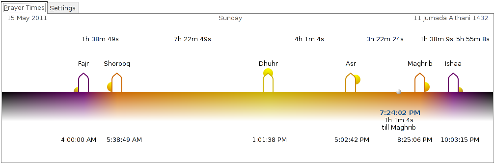
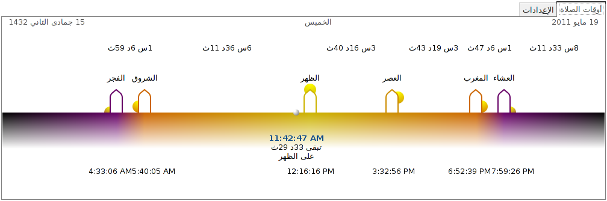

Mihrab
======

Mihrab is a Muslim prayer times program written in C. A mihrab is
semicircular niche in the wall of a mosque that indicates the qibla;
that is, the direction of the Kaaba in Mecca and hence the direction
that Muslims should face when praying
[[Wikipedia](http://en.wikipedia.org/wiki/Mihrab)].

Features
--------

### Current
- Unique presentation.
- Preset library of known locations.
- Custom location option: latitude, longitude, timezone, daylight
  saving time (DST).
- Automatic detection of daylight saving time (DST) status for known
  locations.

### Planned
- Stack multiple timelines to show multiple locations at once.
- Add support for playing Athan audio.
- Add support for a notification area icon.
- Desktop notification popups.
- Improved layout.

Requirements
------------

- [GTK+](http://www.gtk.org) version 2 (default branch) or 3 (branch
  gtk-3).

    Debian package: `libgtk2.0-dev` or `libgtk-3-dev`.

- The Islamic Tools Library
  [libitl](http://projects.arabeyes.org/project.php?proj=ITL).

    Debian package: `libitl-dev`.

- libgweather: a weather library for the Gnome desktop.

    Debian package: `libgweather-dev` or `libgweather-3-dev`.

Usage
-----

    $ hg clone https://akhayyat@bitbucket.org/akhayyat/mihrab
    $ cd mihrab
    $ make
    $ ./bin/release/mihrab

Translation
-----------

Arabic translation of all strings is included. `make` will generate an
Arabic message catalog. To run Mihrab in Arabic:

    $ LANGUAGE=ar ./bin/release/mihrab

If you would like to add a new language translation, follow these steps:

1. Generate a `pot` file (Portable Object Template):

        $ make pot

    This will generate `mihrab.pot` in the project's root directory.

2. Use your favorite `po` file editor, e.g. POEdit, to create the
translated strings based on the pot template.

3. Add the two-letter language code to the `LANGS` macro in the
`Makefile`. For example:

        LANGS = ar de

    In this example, the `Makefile` expects to find the files
    `./ar/mihrab.po` and `./de/mihrab.po` in the project's root
    directory. Any subsequent `make` will generate the required
    catalogs to use these languages.

Screenshots
-----------

